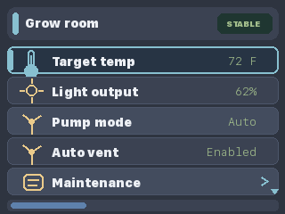
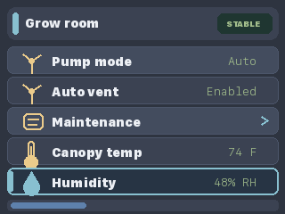
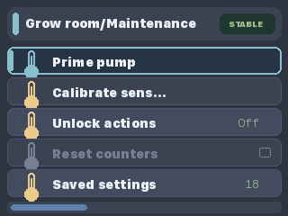

# CYDAuroraPanel

`CYDAuroraPanel` is a graphical BetterMenu example for ESP32-2432S028R-style "Cheap Yellow Display" boards with a 320x240 ILI9341 TFT.

The menu is still declared once in the sketch. The CYD-specific code is only the `TFT_eSPI` display adapter that draws BetterMenu's `menu_render_line_t` metadata: title rows, selected state, editing state, disabled rows, child-menu hints, scroll indicators, labels, and formatted values.

Configure `TFT_eSPI` for your CYD board before compiling this sketch. Input is Serial keys so the display adapter stays independent of any one touch-controller wiring. A touch adapter can be added separately by returning `menu_row_event()` events.

Serial controls:

- `w` / `s`: up / down
- `e` or `d`: select, enter, toggle, or save
- `q` or `a`: back or cancel

## Startup

## After Six Down Inputs

The first four Down inputs move the selection through the visible rows. The fifth and sixth Down inputs scroll the viewport far enough to bring the last item into view.

## Maintenance Menu

The maintenance submenu demonstrates actions, a boolean unlock, a disabled action, and a read-only value.

