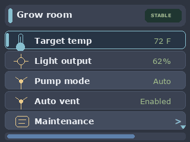

# CYDAuroraPanel

`CYDAuroraPanel` is a graphical BetterMenu example for ESP32-2432S028R-style "Cheap Yellow Display" boards with a 320x240 ILI9341 TFT.

The menu is still declared once in the sketch. The CYD-specific code is only the `TFT_eSPI` display adapter that draws BetterMenu's `menu_render_line_t` metadata: title rows, selected state, editing state, disabled rows, child-menu hints, scroll indicators, labels, and formatted values.

This example keeps the graphical adapter focused on render metadata only. For a denser CYD layout that also passes runtime context into the display adapter to draw a proportional scrollbar, see `examples/CYDRoverConsole`.

Configure `TFT_eSPI` for your CYD board before compiling this sketch. Input is Serial keys so the display adapter stays independent of any one touch-controller wiring. A touch adapter can be added separately by returning `menu_row_event()` events.

Serial controls:

- `w` / `s`: up / down
- `e` or `d`: select, enter, toggle, or save
- `q` or `a`: back or cancel

## Navigation Walkthrough

The animation shows navigation through the grow-room root menu and maintenance submenu. It also demonstrates mutable value edits, select and boolean changes, disabled-row rendering, read-only values, child-menu navigation, and scroll hints.

