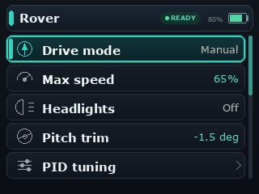

# CYDRoverConsole

`CYDRoverConsole` is a graphical BetterMenu example for ESP32-2432S028R-style "Cheap Yellow Display" boards with a 320x240 ILI9341 TFT.

The menu is still declared once in the sketch. The CYD-specific code is the `TFT_eSPI` display adapter that draws BetterMenu's `menu_render_line_t` metadata, then uses the active `menu_runtime_t` context to derive a proportional faux scrollbar from the current visible row window.

This example is the more advanced CYD display path. For a simpler graphical adapter that only consumes `menu_render_line_t` metadata, start with `examples/CYDAuroraPanel`.

Configure `TFT_eSPI` for your CYD board before compiling this sketch. Input is Serial keys so the display adapter stays independent of any one touch-controller wiring. A touch adapter can be added separately by returning `menu_row_event()` events.

Serial controls:

- `w` / `s`: up / down
- `e` or `d`: select, enter, toggle, or save
- `q` or `a`: back or cancel

## Navigation Walkthrough

The animation shows navigation through the rover root menu, PID tuning submenu, sensors submenu, and system submenu. It also demonstrates selection changes, mutable value edits, floating-point style values, boolean toggles, disabled-row rendering, breadcrumb navigation, and the proportional scrollbar.

