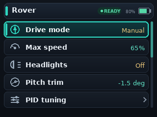
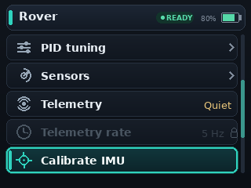
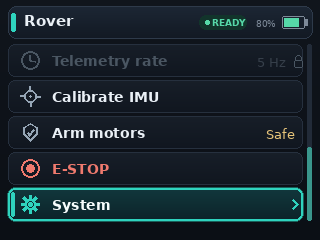
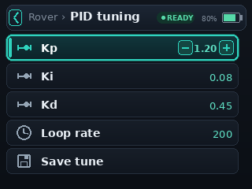

# CYDRoverConsole

`CYDRoverConsole` is a graphical BetterMenu example for ESP32-2432S028R-style "Cheap Yellow Display" boards with a 320x240 ILI9341 TFT.

The menu is still declared once in the sketch. The CYD-specific code is the `TFT_eSPI` display adapter that draws BetterMenu's `menu_render_line_t` metadata, then uses the active `menu_runtime_t` context to derive a proportional faux scrollbar from the current visible row window.

This example is the more advanced CYD display path. For a simpler graphical adapter that only consumes `menu_render_line_t` metadata, start with `examples/CYDAuroraPanel`.

Configure `TFT_eSPI` for your CYD board before compiling this sketch. Input is Serial keys so the display adapter stays independent of any one touch-controller wiring. A touch adapter can be added separately by returning `menu_row_event()` events.

Serial controls:

- `w` / `s`: up / down
- `e` or `d`: select, enter, toggle, or save
- `q` or `a`: back or cancel

## Startup

The startup view shows the rover root menu, status chip, battery indicator, semantic row icons, and a proportional scrollbar thumb at the top of the track.

## After Seven Down Inputs

The Down inputs move through selectable rows and skip the disabled telemetry-rate row. The scrollbar thumb moves with the visible item window rather than using a fixed decoration.

## End Of Menu

The final root-menu viewport shows disabled-row lock rendering, alert coloring for `E-STOP`, and the scrollbar thumb at the bottom of the track.

## PID Editing

The PID submenu demonstrates breadcrumb rendering and inline edit controls for an integer-like value.

